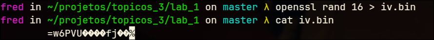
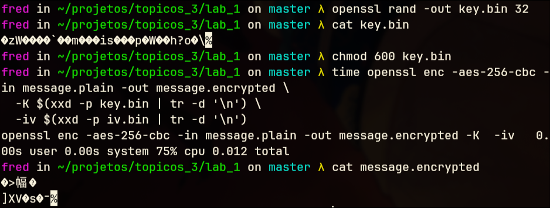
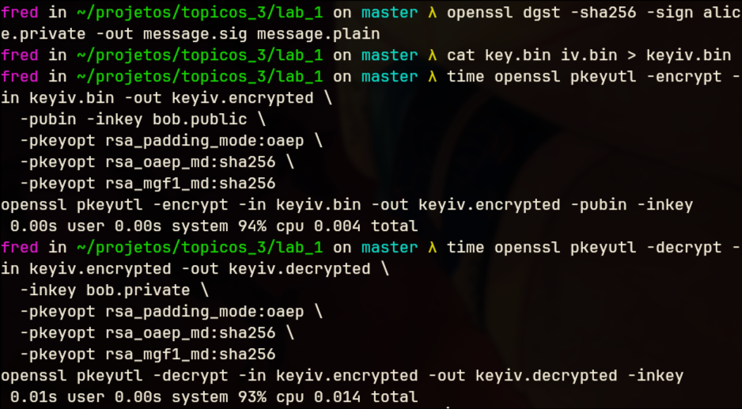
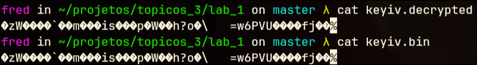
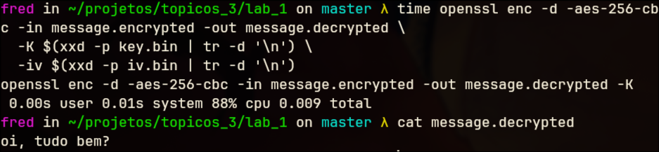
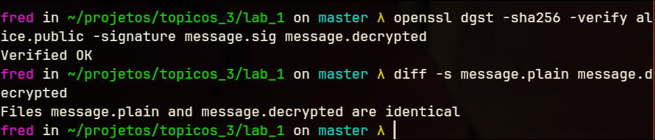

# Laboratório de Criptografia com OpenSSL

Nome: Frederico Fabricio Pereira de Souza
Matrícula: 221030965

## Objetivo

- Gerar pares de chaves RSA para diferentes usuários (Alice e Bob).
- Utilizar criptografia assimétrica com RSA-OAEP para proteger mensagens curtas.
- Realizar assinatura digital e verificação de assinaturas utilizando SHA-256 e RSA.
- Aplicar criptografia simétrica com AES-256-CBC em mensagens maiores.
- Implementar um esquema de cifra híbrida combinando RSA e AES.
- Entender a função do padding OAEP e do vetor de inicialização (IV) na segurança criptográfica.
- Validar a integridade e autenticidade das mensagens por meio da comparação e verificação dos arquivos gerados.
- Familiarizar-se com comandos e ferramentas do OpenSSL em ambiente Linux.

## Geração de chaves RSA

As chaves foram geradas segundo o roteiro usando os comandos:

```sh
openssl genpkey -algorithm RSA -pkeyopt rsa_keygen_bits:2048 -out pessoa.private

openssl pkey -in pessoa.private -pubout -out pessoa.public

```

Foram-se criadas as chaves privadas/públicas tanto para Alice quanto para Bob.


## Mensagem curta confidencial (ALICE->BOB)


### Codificação da mensagem

Estaremos usando o arquivo message.plain em que o conteúdo é:

```
Oi, tudo bem?
```

Vamos usar o comando:

```sh
time openssl pkeyutl -encrypt -in message.plain -out message.encrypted \
  -pubin -inkey bob.public \
  -pkeyopt rsa_padding_mode:oaep \
  -pkeyopt rsa_oaep_md:sha256 \
  -pkeyopt rsa_mgf1_md:sha256
```

Para gerar um arquivo de saída *message.encrypted* que será a nossa mensagem criptografada.

-# O comando *time* antes do comando de criptografia nos mostra quanto tempo o comando levou para executar e quanto de CPU utilizou.

A saída do comando se dá por:


E a mensagem codificada se dá por:


### Decodificação da mensagem

Para fazermos o caminho reverso, usaremos o comando:

```sh
time openssl pkeyutl -decrypt -in message.encrypted -out message.decrypted \
  -inkey bob.private \
  -pkeyopt rsa_padding_mode:oaep \
  -pkeyopt rsa_oaep_md:sha256 \
  -pkeyopt rsa_mgf1_md:sha256
```

E a nossa saída foi:


E usando o comando *diff*, vemos se há alguma diferença entre o arquivo original e o decodificado:


## Mensagem curta assinada (ALICE -> BOB)

Usando o comando:

```sh
time openssl pkeyutl -encrypt -in message.plain -out message.encrypted \
  -pubin -inkey bob.public \
  -pkeyopt rsa_padding_mode:oaep \
  -pkeyopt rsa_oaep_md:sha256 \
  -pkeyopt rsa_mgf1_md:sha256
```

Temos a saída:


E verificamos a assinatura com:

```sh
time openssl dgst -sha256 -verify bob.public -signature message.sig message.plain
```

com saída:


## Mensagem grande - Cifra híbrida (ALICE->BOB)

A partir daqui usaremos [RSA-OAEP](https://en.wikipedia.org/wiki/Optimal_asymmetric_encryption_padding).

Vamos gerar nosso vetor de inicialização para garantir aleatoriedade e segurança:



-# Neste print mostra que eu criei fora do meu diretório do laboratório 1. Mas já movi o binário para o diretório do projeto.

Agora vamos gerar nossa mensagem decodificada com o comando:

```sh
time openssl enc -aes-256-cbc -in message.plain -out message.encrypted \
  -K $(xxd -p key.bin | tr -d '\n') \
  -iv $(xxd -p iv.bin | tr -d '\n')
```

Onde geramos a saída:



Precisamos agora:


- Assinar com a chave privada de Alice com SHA-256

```sh
openssl dgst -sha256 -sign alice.private -out message.sig message.plain
```

- Concatenar a key.bin com iv.bin

```sh
cat key.bin iv.bin > keyiv.bin
```

- Cifrar key.bin + iv.bin com a assinatura pública de bob usando RSA-OAEP

```sh
openssl pkeyutl -encrypt -in keyiv.bin -out keyiv.encrypted \
  -pubin -inkey bob.public \
  -pkeyopt rsa_padding_mode:oaep \
  -pkeyopt rsa_oaep_md:sha256 \
  -pkeyopt rsa_mgf1_md:sha256
```


- E decodificá-la em seguida

```sh
openssl pkeyutl -decrypt -in keyiv.encrypted -out keyiv.decrypted \
  -inkey bob.private \
  -pkeyopt rsa_padding_mode:oaep \
  -pkeyopt rsa_oaep_md:sha256 \
  -pkeyopt rsa_mgf1_md:sha256
```






Extraímos a chave AES:


Deciframos a mensagem:




### Para desencargo de consciência

Vamos verificar a assinatura de alice com a chave pública e comparar o arquivo message.decrypted com a mensagem original:



## Perguntas

- Para que serve o padding OAEP?
R. É um esquema de preenchimento (padding) usado em algoritmos de criptografia assimétricas para tornar muito a segurança da mensagem mais sólida contra ataques modernos de adivinhação. Ele combina a mensagem a ser criptografada com uma *seed* aleatória com operações de hash e xor.

- Qual é a função do IV?
R. É o nosso vetor de inicialização que usamos para impedir que atacantes percebam um padrão na tentativa de quebra da criptografia.

- Por que usamos cifra híbrida para mensagens grandes?
R. Pois se usássemos RSA, teriamos um enorme tempo de processamento para criptografar uma mensagem de por exemplo 100Mb. E se usássemos AES, precisaríamos compartilhar a chave com a outra entidade comunicante pela rede. E isso traria problemas caso a chave fosse interceptada por terceiros.

## Conclusão 

Neste laboratório, aprendemos a utilizar criptografia com RSA moderno, RSA-OAEP, AES-256-CBC e entendimento da robustez e segurança na utilização de cifra híbrida. A maior dificuldade deste experimento foi na utilização da cifra híbrida. Entendemos que é o AES que cifra a mensagem e o RSA-OAEP que protege a chave AES e IV.

# FIM
