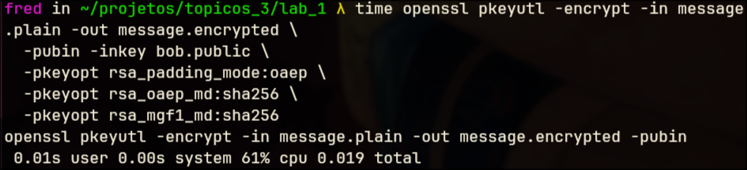
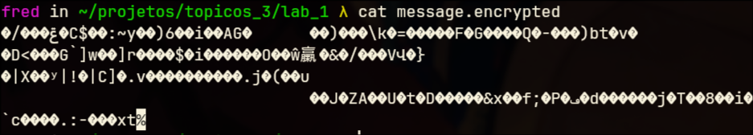
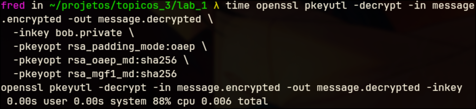
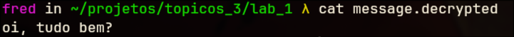
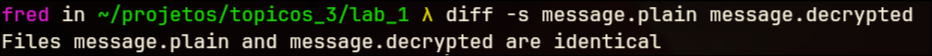
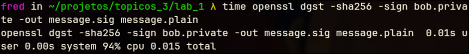
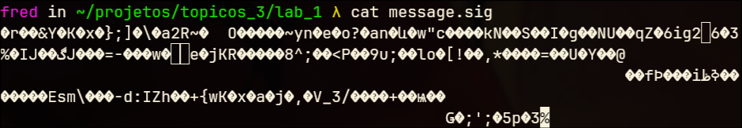
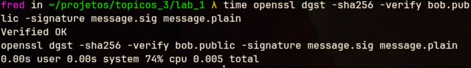

# Laboratório de Criptografia com OpenSSL

Nome: Frederico Fabricio Pereira de Souza
Matrícula: 221030965

## Objetivo

- Gerar pares de chaves RSA para diferentes usuários (Alice e Bob).
- Utilizar criptografia assimétrica com RSA-OAEP para proteger mensagens curtas.
- Realizar assinatura digital e verificação de assinaturas utilizando SHA-256 e RSA.
- Aplicar criptografia simétrica com AES-256-CBC em mensagens maiores.
- Implementar um esquema de cifra híbrida combinando RSA e AES.
- Entender a função do padding OAEP e do vetor de inicialização (IV) na segurança criptográfica.
- Validar a integridade e autenticidade das mensagens por meio da comparação e verificação dos arquivos gerados.
- Familiarizar-se com comandos e ferramentas do OpenSSL em ambiente Linux.

## Geração de chaves RSA

As chaves foram geradas segundo o roteiro usando os comandos:

```sh
openssl genpkey -algorithm RSA -pkeyopt rsa_keygen_bits:2048 -out pessoa.private

openssl pkey -in pessoa.private -pubout -out pessoa.public

```

Foram-se criadas as chaves privadas/públicas tanto para Alice quanto para Bob.


## Mensagem curta confidencial (ALICE->BOB)


### Codificação da mensagem

Estaremos usando o arquivo message.plain em que o conteúdo é:

```
Oi, tudo bem?
```

Vamos usar o comando:

```sh
time openssl pkeyutl -encrypt -in message.plain -out message.encrypted \
  -pubin -inkey bob.public \
  -pkeyopt rsa_padding_mode:oaep \
  -pkeyopt rsa_oaep_md:sha256 \
  -pkeyopt rsa_mgf1_md:sha256
```

Para gerar um arquivo de saída *message.encrypted* que será a nossa mensagem criptografada.

-# O comando *time* antes do comando de criptografia nos mostra quanto tempo o comando levou para executar e quanto de CPU utilizou.

A saída do comando se dá por:



E a mensagem codificada se dá por:



### Decodificação da mensagem

Para fazermos o caminho reverso, usaremos o comando:

```sh
time openssl pkeyutl -decrypt -in message.encrypted -out message.decrypted \
  -inkey bob.private \
  -pkeyopt rsa_padding_mode:oaep \
  -pkeyopt rsa_oaep_md:sha256 \
  -pkeyopt rsa_mgf1_md:sha256
```

E a nossa saída foi:





E usando o comando *diff*, vemos se há alguma diferença entre o arquivo original e o decodificado:



## Mensagem curta assinada (ALICE -> BOB)

Usando o comando:

```sh
time openssl pkeyutl -encrypt -in message.plain -out message.encrypted \
  -pubin -inkey bob.public \
  -pkeyopt rsa_padding_mode:oaep \
  -pkeyopt rsa_oaep_md:sha256 \
  -pkeyopt rsa_mgf1_md:sha256
```

Temos a saída:





E verificamos a assinatura com:

```sh
time openssl dgst -sha256 -verify bob.public -signature message.sig message.plain
```

com saída:




