# Laboratório de criptografia simétrica com openssl

Nome: Frederico Fabrício Pereira de Souza
Matrícula: 221030965

## Objetivo

Explorar o funcionamento do AES em todos os modos de operação disponíveis no OpenSSL, além de comparar com o algoritmo moderno ChaCha20. Avaliar diferenças de segurança, desempenho e aplicabilidade em redes de comunicação.

## AES em todos os modos de operação

Primeiro, temos nosso arquivo *texto.txt* em que seu conteúdo é:

```
Circumstances are not always in thine control
The words truly are thine greatest weapons
I have a request for thee...
```

-# Neste laboratório a maioria dos comandos que usaremos serão acompanhados pelo comando *time* para checar o tempo de execução e uso de CPU

### AES-256-ECB (Electronic Codebook)

Comando para criptografar: 

```sh
openssl enc -aes-256-ecb -in texto.txt -out texto_ecb.enc
```

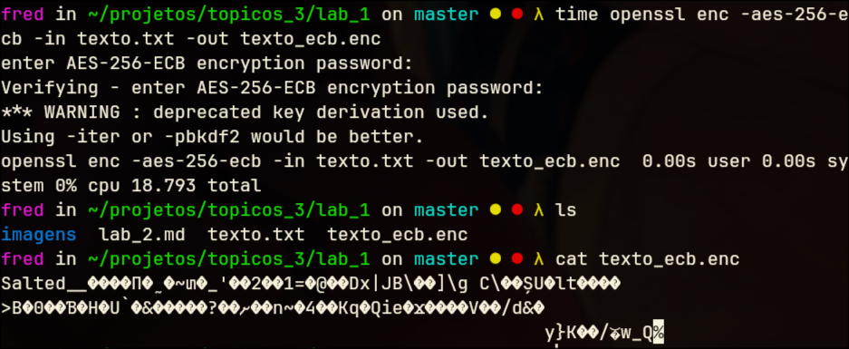

> Como não usei um arquivo key.bin, o próprio programa pediu uma senha. E esta senha colocada foi "mononobe"

Comando para decodificar:

```sh
openssl enc -aes-256-ecb -d -in texto_ecb.enc -out texto_ecb_dec.txt
```

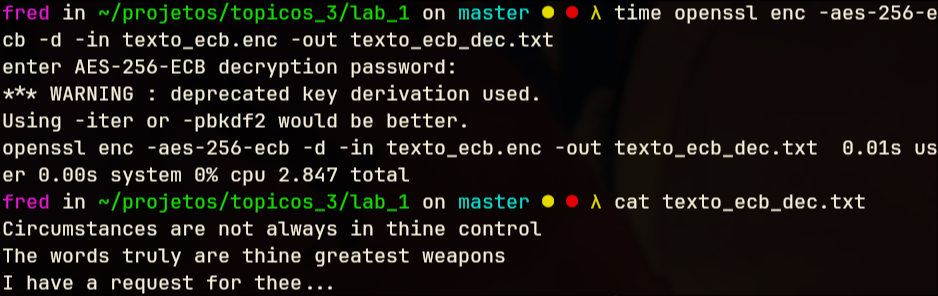

> O que aconteceria se colocássemos uma chave errada?

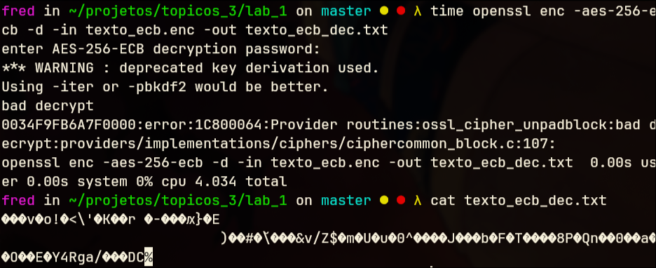

Recebemos um bad decrypt e nosso arquivo *texto_ecb_dec.txt* não está igual ao arquivo original!

### AES-256-CBC (Cipher Block Chaining)

Comando para criptografar:

```sh
openssl enc -aes-256-cbc -salt -in texto.txt -out texto_cbc.enc
```

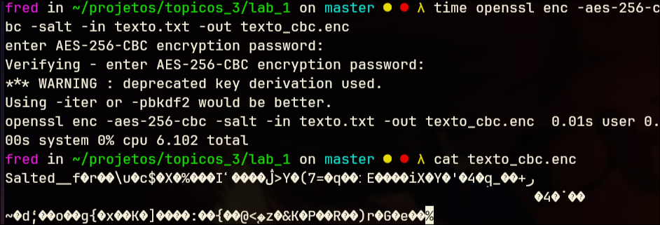

> Aqui novamente usei a mesma senha "mononobe" (e usarei para os outros modos também). Deprecated key derivation é apenas um waring, como estamos fazendo para um laboratório, não haverão problemas.


Comando para decodificar:

```sh
openssl enc -aes-256-cbc -d -in texto_cbc.enc -out texto_cbc_dec.txt
```

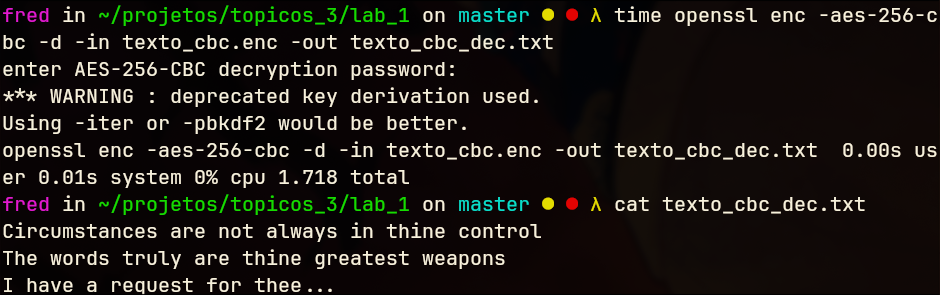

### AES-256-CFB (Cipher Feedback)

Comando para criptografar:

```sh
openssl enc -aes-256-cfb -in texto.txt -out texto_cfb.enc
```

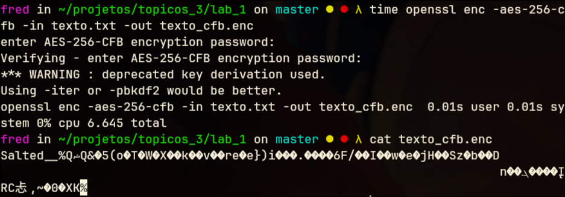


Comando para decodificar:

```sh
openssl enc -aes-256-cfb -d -in texto_cfb.enc -out texto_cfb_dec.txt
```


### AES-256-OFB (Output Feedback)

Comando para criptografar:

```sh
openssl enc -aes-256-ofb -in texto.txt -out texto_ofb.enc
```

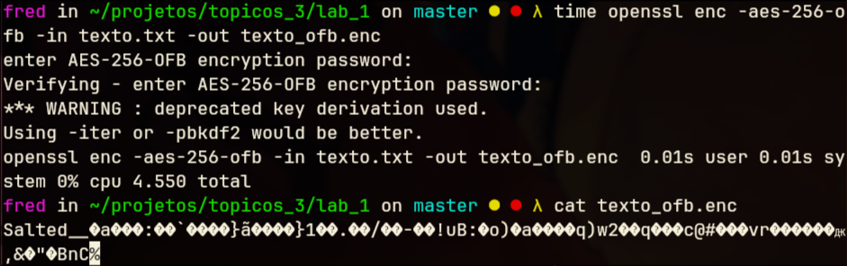

Comando para decodificar:

```sh
openssl enc -aes-256-ofb -d -in texto_ofb.enc -out texto_ofb_dec.txt
```

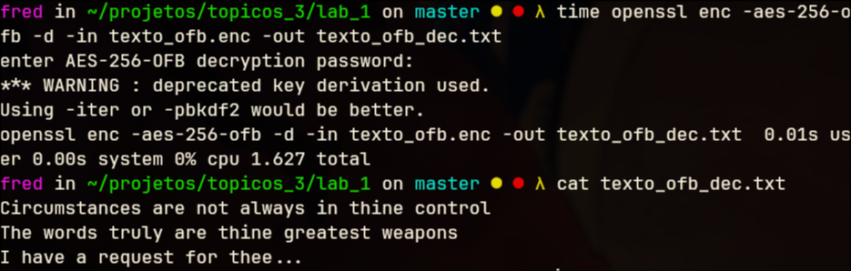

### AES-256-CTR (Counter Mode)

Comando para criptografar:

```sh
openssl enc -aes-256-ctr -in texto.txt -out texto_ctr.enc
```
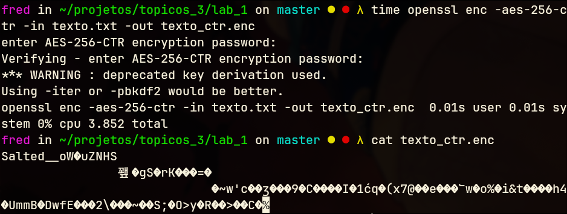

Comando para decodificar:

```sh
openssl enc -aes-256-ctr -d -in texto_ctr.enc -out texto_ctr_dec.txt
```

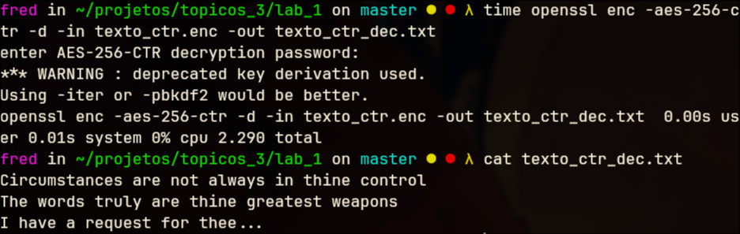

## ChaCha20

Usando a cifra de fluxo ChaCha20:

```sh
openssl enc -chacha20 -in texto.txt -out texto_chacha.enc

```
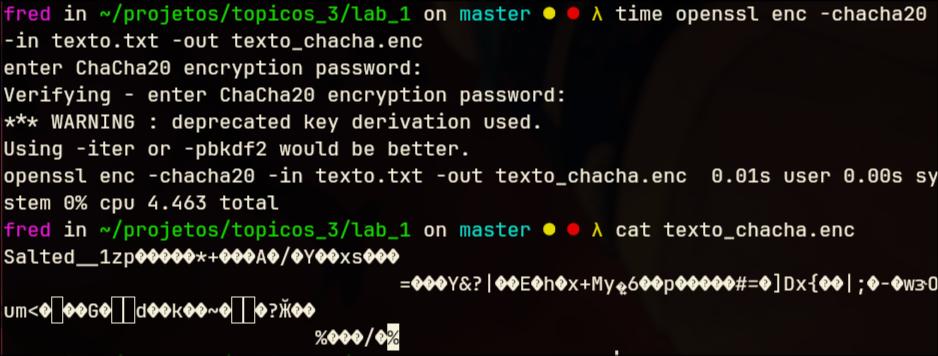

Decodificando:

```sh
openssl enc -chacha20 -d -in texto_chacha.enc -out texto_chacha_dec.txt
```


## Experimento de performance

> Vimos anteriormente que para um arquivo pequeno de 118 bytes, o tempo de cifragem é minúsculo, quase não dá para comparar. Então...

Vamos gerar um arquivo de 100MB usando:

```sh
dd if=/dev/urandom of=arquivo100M.txt bs=1M count=100
```

E iremos medir o tempo de cifragem de cada modo usando:

```sh
time openssl enc -aes-256-ecb -in arquivo100M.txt -out teste_ecb.enc
time openssl enc -aes-256-cbc -in arquivo100M.txt -out teste_cbc.enc
time openssl enc -aes-256-cfb -in arquivo100M.txt -out teste_cfb.enc
time openssl enc -aes-256-ofb -in arquivo100M.txt -out teste_ofb.enc
time openssl enc -aes-256-ctr -in arquivo100M.txt -out teste_ctr.enc
time openssl enc -chacha20 -in arquivo100M.txt -out teste_chacha.enc
```

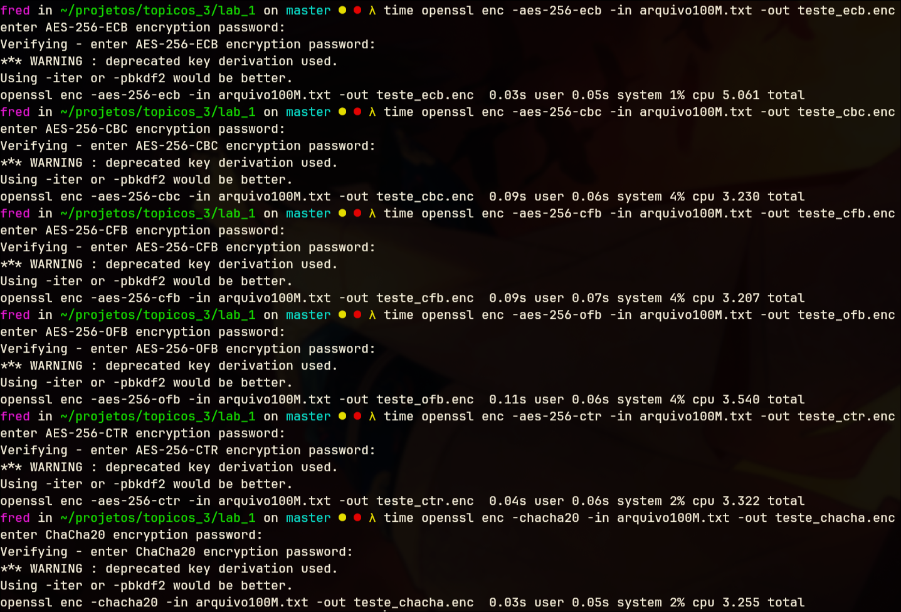

## Questões

- Qual modo de operação apresentou melhor desempenho?

> Os dois modos que foram mais rápidos foram o ECB e ChaCha20. O tempo total deles difere pois houve uma demora no I/O para colocar uma chave.

- Por que o ECB é considerado inseguro mesmo sendo rápido?

> O ECB preserva padrões e por isso se torna fácil de ser analisado. Ele criptografa os dados de forma isolada e bem previsível. Ou seja, a estrutura dos dados ficam parcialmente reveladas pois os blocos do texto original são idênticos aos blocos cifrados.

- Quais modos são mais adequados para redes de comunicação?

> São aqueles que oferecem equilíbrio entre segurança, velocidade e integridade. Em ordem, pelo analisado neste experimento: ChaCha20, AES-CTR e AES-CBC (muito mais lento em relação aos mencionados).

- O que diferencia o ChaCha20 do AES em termos de eficiência e segurança?

> ChaCha20 é uma cifra de fluxo e AES é uma cifra de bloco. ChaCha20 tende a ser bem mais rápido que AES em questão de software, mas para hardware AES consegue ser bem sólido. Em termos de segurança, o ChaCha20 consegue sair melhor que o AES pois o AES pode ser vulnerável a ataques de medição de tempo, o que por outro lado, o ChaCha20 é imune a tais ataques.

- Como essa prática se relaciona com protocolos como TLS, IPsec e VPNs modernas?

> Tanto TLS, IPsec usam cifras simétricas. Não totalmente por questões de segurança e logística, mas usam um modelo de cifras híbridas em que eles empregam tanto o ChaCha20 quanto o AES (na parte simétrica) porque cifras simétricas tendem a ser mais rápidas.
